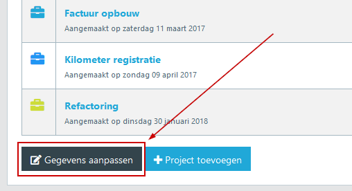
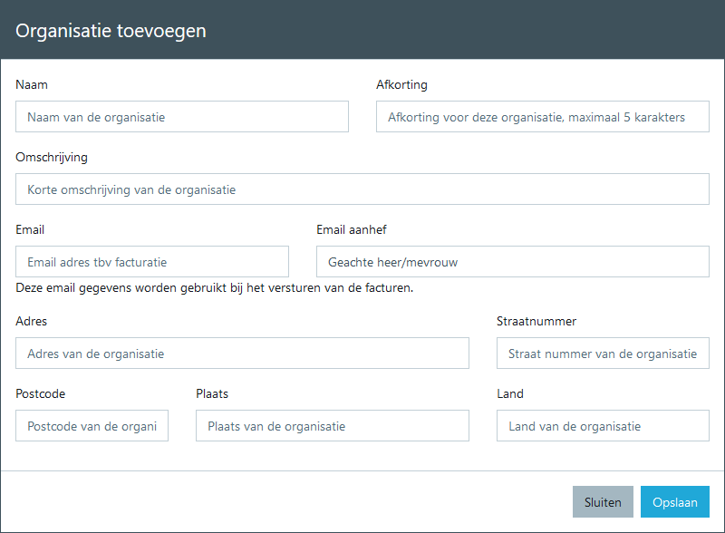

# Overzicht

Voordat je uren, reiskosten en of onkosten wilt factureren, dien je eerst een organisatie aan te maken. Een organisatie is de overkoepelende 'container' waar projecten aan kunnen worden gekoppeld. Je kan natuurlijk meerdere organisaties aanmaken en per organisatie kan je meerdere projecten aanmaken.

Je moet minimaal 1 organisatie hebben en een organisatie moet minimaal 1 project hebben.

## Detail overzicht

Het detail overzicht van een organisatie laat de onderliggende [projecten](../projecten/overzicht) zien. Vanuit hier is het mogelijk om de gegevens van een organisatie aan te passen.

## Nieuwe organisatie toevoegen

Voor het toevoegen van een organisatie is een aantal gegevens belangrijk. Hieronder een overzicht van de gegevens die je nodig hebt om een organisatie aan te maken:

* Naam, dit is de naam van het bedrijf
* Afkorting, hier kan je een afkorting bepalen. Deze afkorting wordt alleen gebruikt bij het factureren. De naam van de factuur kan, indien gewenst deze naam opnemen.
* Omschrijving, geef hiervoor een korte omschrijving van dorganisatie. Dit is alleen voor eigen informatie en wordt niet gebruikt in communicatie naar buiten.
* Email, geef hier het email adres op waar je de factuur naar toe kan mailen.
* Email aanhef, geef hier de aanhef op die je wilt gebruiken bij een factuur naar deze organisatie. De inhoud van de mail kan generiek worden bepaald. De aanhef is uniek per organisatie.
* Adres, vul hier de straatnaam in van de organisatie
* Straatnummer, vul hier het straat nummer in van de organisatie
* Postcode, vul hier de postcode in van de organisatie
* Plaats, vul hier de plaats in van de organisatie
* Land, vul hier het land in van de organisatie

## Organisatie verwijderen

> Het verwijderen van een organisatie is een ingrijpende handeling. Dit houdt in dat alle onderliggende projecten en de daaraan gekoppelde werkzaamheden zullen worden verwijderd. Het verwijderen van een organisatie is daarom op dit moment nog niet mogelijk. Alleen bij het verwijderen van een account zal alle gerelateerde data worden verwijderd.